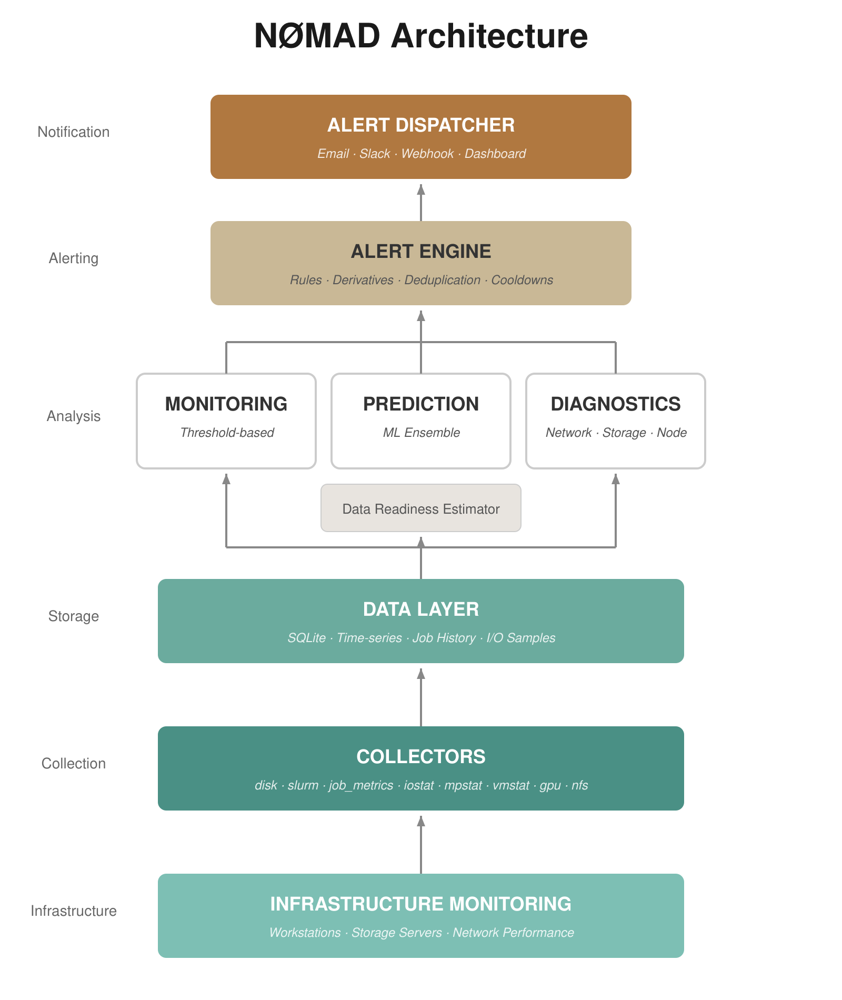

# Software paper for submission to the Journal of Open Research Software

## (1) Overview

### Title
NØMADE: Lightweight HPC Monitoring with Machine Learning-Based Failure Prediction

### Paper Authors
1. Tonini, João Filipe Riva (corresponding author)

### Paper Author Roles and Affiliations
1. Academic Research Computing, University of Richmond, Richmond, VA 23173, USA.
   - Email: jtonini@richmond.edu
   - ORCID: 0000-0002-4730-3805

### Abstract
NØMADE (NOde MAnagement DEvice) is a lightweight monitoring and predictive analytics tool for computing infrastructure. It collects system metrics (disk, CPU, memory, I/O, GPU) from any Linux system, with optional SLURM integration for job-level analytics. Data is stored in SQLite, and machine learning models predict job failures before they occur. A key innovation is modeling jobs as nodes in a similarity network, where connections represent shared resource usage patterns. Jobs with similar characteristics often share similar outcomes, and the network structure reveals failure-prone regions in the feature space. The tool provides a real-time web dashboard and supports alerts via email, Slack, or webhooks. NØMADE requires no external databases or complex infrastructure, making it suitable for small-to-medium HPC centers and research groups.

### Keywords
HPC; high-performance computing; monitoring; machine learning; SLURM; predictive analytics; failure prediction

### Introduction
HPC administrators face a persistent challenge: detecting job failures before they impact researchers. Enterprise monitoring solutions like Prometheus, Grafana, or Nagios require significant infrastructure and target general IT systems rather than HPC-specific workloads. Existing HPC tools such as TACC Stats [1], XDMoD [2], and LLNL's Lightweight Distributed Metric Service [3] provide detailed metrics but require substantial deployment effort and focus on post-hoc analysis rather than real-time prediction.

Common HPC failure patterns include NFS saturation (jobs writing to network storage instead of local scratch), memory leaks (gradual consumption leading to out-of-memory kills), GPU thermal throttling (temperature-induced performance degradation), and queue starvation (resource contention causing excessive wait times). These failures often exhibit warning signs minutes to hours before critical thresholds are breached.

NØMADE addresses this gap by providing: (1) zero-infrastructure deployment using a single SQLite database with no external services; (2) system-level monitoring that works on any Linux system without requiring HPC software; (3) optional SLURM integration for job-level analytics and predictive alerts; and (4) similarity-based analysis that learns failure patterns from historical data.

A key innovation is the use of similarity networks for failure prediction. Each job is characterized by a 17-dimensional feature vector capturing resource usage patterns (CPU efficiency, memory consumption, I/O behavior, etc.). Jobs are connected in a network when their feature vectors exceed a cosine similarity threshold, creating clusters of jobs with similar resource profiles. Because jobs with similar characteristics often experience similar outcomes, the network structure reveals failure-prone regions in the feature space. This approach enables both real-time risk assessment for running jobs and actionable recommendations for users—for example, identifying that jobs with high NFS write ratios have elevated failure rates and suggesting the use of local scratch storage instead.

### Implementation and Architecture
NØMADE is implemented in Python and follows a modular architecture with four main components (Figure 1):

*Figure 1: NØMADE system architecture showing the data flow from collectors through the analysis engines to the alert dispatcher and web dashboard. The monitoring engine handles threshold-based alerts while the prediction engine uses ML models for proactive failure detection.*

**Collectors** gather metrics from standard Linux tools (`iostat`, `vmstat`, `nvidia-smi`, `nfsiostat`) and filesystem utilities. When SLURM is available, additional collectors provide queue state (`squeue`, `sinfo`), job history (`sacct`), and per-job I/O statistics from `/proc/[pid]/io`. Collectors gracefully skip when their requirements are not met (e.g., no GPU monitoring without `nvidia-smi`).

**Feature Engineering** transforms raw metrics into a feature vector per job. System-level features include I/O wait, memory pressure, swap activity, and device utilization from `iostat`, `mpstat`, and `vmstat`. When SLURM is available, job-specific features (CPU/memory efficiency, NFS write ratios, runtime) extend the vector to 17 dimensions. These features enable similarity-based analysis across jobs using cosine similarity.

**ML Prediction** uses an ensemble of three models: a Graph Neural Network (GNN) that captures relationships between similar jobs based on cosine similarity of feature vectors; an LSTM that detects temporal patterns and early warning trajectories; and an Autoencoder that identifies anomalous jobs deviating from normal behavior. The ensemble outputs a continuous risk score (0–1) rather than binary classification.

**Alert System** supports both threshold-based alerts (disk usage, GPU temperature) and predictive alerts using derivative analysis. When the rate of change indicates a threshold will be breached, alerts fire before the actual breach occurs. Notifications route through email, Slack, or webhooks with configurable cooldowns.

### Web Dashboard
NØMADE provides a real-time web dashboard for monitoring cluster health and job status (Figure 2). The dashboard displays partition-specific metrics including queue depth, node utilization, and resource consumption patterns.

*Figure 2: NØMADE web dashboard showing real-time cluster status. Panel A displays compute partition metrics, Panel B shows high-memory partition status, Panel C presents GPU partition health, and Panel D visualizes the job similarity network. The interface provides at-a-glance monitoring for HPC administrators.*

The dashboard includes partition-specific views that allow administrators to monitor different resource types independently (Figure 3). Each partition view displays relevant metrics: CPU utilization and memory pressure for compute partitions, GPU temperature and VRAM usage for GPU partitions, and memory allocation patterns for high-memory partitions.

| Compute Partition | GPU Partition | High-Memory Partition |
|:-----------------:|:-------------:|:---------------------:|
|  |  |  |

*Figure 3: Partition-specific dashboard views showing compute (top left, 6-node partition with CPU utilization), GPU (top right, 2-node partition with GPU metrics), and high-memory (bottom, 2-node partition optimized for memory-intensive jobs). Each view displays node health rings, job statistics, and resource utilization bars specific to the partition type.*

### Job Similarity Network
A distinguishing feature of NØMADE is the job similarity network visualization (Figure 4). Jobs are represented as nodes in a 3D space defined by their I/O characteristics: NFS write ratio, local write volume, and I/O wait percentage. When full job metrics are available, edges connect jobs with cosine similarity ≥ 0.7 based on their feature vectors.

*Figure 4: Three-dimensional job similarity network visualization. Jobs are positioned by their I/O behavior (NFS writes, local writes, I/O wait) and colored by health score (green = healthy, red = failed). Clustering reveals failure patterns: jobs in the high-NFS, high-I/O-wait region show elevated failure rates compared to jobs using local storage.*

This visualization reveals how failures cluster in specific regions of the feature space. Jobs in the "danger zone" (high NFS ratio, high I/O wait) show significantly higher failure rates than jobs in the "safe zone" (low NFS ratio, high local writes). Because these patterns emerge from historical data rather than predefined rules, the system can discover site-specific failure modes and provide targeted recommendations to users (e.g., "jobs with your I/O pattern have a 72% failure rate—consider using local scratch instead of NFS").

### Quality Control
NØMADE includes a comprehensive test suite covering unit tests for collectors, feature engineering, and ML components; integration tests for the full data pipeline; a demo mode (`nomade demo`) that generates synthetic HPC data for testing without requiring a real cluster; and continuous integration via GitHub Actions.

The software has been tested on clusters ranging from 6 to 200 nodes, including both CPU-only and GPU-enabled partitions. The codebase follows PEP 8 style guidelines and includes type hints for improved maintainability.

## (2) Availability

### Operating System
Linux (tested on Ubuntu 22.04, Rocky Linux 9, CentOS 7)

### Programming Language
Python 3.9+

### Additional System Requirements
- SLURM workload manager (optional, enables job-level analytics)
- sysstat package (`iostat`, `mpstat`) for system metrics
- Network access for dashboard (default port 5000)
- Minimal disk space for SQLite database (~1MB per 10,000 samples)

### Dependencies
- click ≥ 8.0
- toml ≥ 0.10
- numpy ≥ 1.21
- pandas ≥ 1.3
- scipy ≥ 1.7
- scikit-learn (optional, for ML features)
- torch (optional, for GNN/LSTM models)
- torch-geometric (optional, for graph neural networks)

### List of Contributors
1. Tonini, João Filipe Riva (Lead developer)

### Software Location

#### Archive
| | |
|---|---|
| Name: | PyPI (Python Package Index) |
| Persistent identifier: | https://pypi.org/project/nomade-hpc/0.3.4/ |
| Licence: | AGPL-3.0-or-later |
| Publisher: | João Filipe Riva Tonini |
| Date published: | January 2026 |

#### Code Repository
| | |
|---|---|
| Name: | GitHub |
| Identifier: | https://github.com/jtonini/nomade |
| Licence: | AGPL-3.0-or-later |
| Date published: | December 2025 |

### Language
English

## (3) Reuse Potential

NØMADE is designed for broad reuse across HPC environments of varying scales. The software can be deployed in several contexts:

**Small Research Groups**: Groups managing individual workstations or small clusters can use NØMADE's zero-infrastructure design to implement sophisticated monitoring without enterprise tools. The `nomade demo` mode allows evaluation without requiring existing HPC infrastructure.

**Medium HPC Centers**: University and institutional HPC centers can deploy NØMADE as either a primary monitoring solution or as a complement to existing tools like Grafana or Nagios, adding predictive capabilities to traditional threshold-based alerting.

**Research Applications**: The similarity network approach provides a framework for studying HPC failure patterns. The community data export feature (`nomade community export`) enables cross-institutional research by generating anonymized datasets suitable for collaborative analysis.

**Educational Use**: The demo mode and clear architecture make NØMADE suitable for teaching HPC administration and monitoring concepts.

### Extension Points
Developers can extend NØMADE in several ways:
- **Custom Collectors**: Add new metric sources by implementing the collector interface
- **Alert Channels**: Integrate additional notification services beyond email/Slack/webhooks
- **ML Models**: Train site-specific models using the provided feature engineering pipeline
- **Dashboard Widgets**: Extend the Flask-based dashboard with custom visualizations

### Support
- GitHub Issues: https://github.com/jtonini/nomade/issues
- Email: jtonini@richmond.edu
- Documentation: https://github.com/jtonini/nomade#readme

Users and developers are welcome to submit bug reports, feature requests, and pull requests via GitHub.

## Acknowledgements
The author thanks George Flanagin for advice and inspiration on HPC system administration, and the University of Richmond's Office of the Provost for financial and resource support.

## Funding Statement
This work was supported by the University of Richmond.

## Competing Interests
The author declares no competing interests.

## References

1. Evans, R.T., Browne, J.C., Barth, W.L. (2014). Comprehensive resource use monitoring for HPC systems with TACC Stats. In: Proceedings of the First International Workshop on HPC User Support Tools, IEEE, pp. 13–21. DOI: https://doi.org/10.1109/SC.2014.18

2. Palmer, J.T., Gallo, S.M., Furlani, T.R., Jones, M.D., DeLeon, R.L., White, J.P., Simakov, N., Patra, A.K., Sperhac, J., Yearke, T., Rathsam, R., Inber, M., Guillen, O., Cornelius, C.D. (2015). Open XDMoD: A tool for the comprehensive management of high-performance computing resources. Computing in Science & Engineering 17(4):52–62. DOI: https://doi.org/10.1109/MCSE.2015.32

3. Agelastos, A., Allan, B., Brandt, J., Cassella, P., Enos, J., Fullop, J., Gentile, A., Monk, S., Naksinehaboon, N., Ogden, J., Rajan, M., Showerman, M., Stevenson, J., Taerat, N., Tucker, T. (2014). The Lightweight Distributed Metric Service: A scalable infrastructure for continuous monitoring of large scale computing systems and applications. In: Proceedings of the International Conference for High Performance Computing, Networking, Storage and Analysis, IEEE, pp. 154–165. DOI: https://doi.org/10.1145/2616498.2616533

4. Pedregosa, F., Varoquaux, G., Gramfort, A., Michel, V., Thirion, B., Grisel, O., Blondel, M., Prettenhofer, P., Weiss, R., Dubourg, V., Vanderplas, J., Passos, A., Cournapeau, D., Brucher, M., Perrot, M., Duchesnay, E. (2011). Scikit-learn: Machine learning in Python. Journal of Machine Learning Research 12:2825–2830. URL: http://jmlr.org/papers/v12/pedregosa11a.html

5. Yoo, A.B., Jette, M.A., Grondona, M. (2003). SLURM: Simple Linux Utility for Resource Management. In: Job Scheduling Strategies for Parallel Processing, Lecture Notes in Computer Science, vol. 2862, Springer, pp. 44–60. DOI: https://doi.org/10.1007/10968987_3
